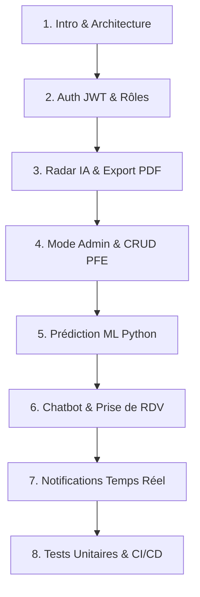

# 🎬 SCÉNARIO DE DÉMONSTRATION DÉTAILLÉ POUR LA SOUTENANCE

**Projet** : Plateforme CodingFactory (DevOps, Incubation PFE & Consulting Numérique)  
**Architecture** : Microservices Spring Boot 3 · Angular 18 · Python FastAPI XGBoost · JWT · Docker & Jenkins CI/CD  
**Durée estimée** : 15 - 20 minutes  

---

## 📋 PLAN DE LA DÉMONSTRATION

---

## 📍 PHASE 1 : INTRODUCTION ET ARCHITECTURE (2 min)

### 💻 Ce qu'il faut afficher sur l'écran :
* Gardez ouvert le fichier [`docker-compose.yml`](file:///c:/Users/user/Desktop/CodingFactoryApp/docker-compose.yml) ou la documentation [`DOCUMENTATION_DETAILLEE_DES_FONCTIONNALITES.md`](file:///c:/Users/user/Desktop/CodingFactoryApp/DOCUMENTATION_DETAILLEE_DES_FONCTIONNALITES.md).

### 🗣️ Script Orale Mot à Mot :
> *"Bonjour Messieurs/Mesdames les membres du jury.*
> 
> *Je vous présente aujourd’hui la plateforme **CodingFactory**, une solution logicielle innovante conçue pour l’incubation des Projets de Fin d’Études (PFE), la recommandation intelligente par Intelligence Artificielle et le conseil numérique.*
> 
> *Notre projet est bâti sur une architecture **Microservices Cloud-Native** modernes :*
> 1. *Un backend en **Java 17 et Spring Boot 3** (sécurité JWT, Eureka Discovery, API Gateway).*
> 2. *Un front-end réactif et modulable en **Angular 18**.*
> 3. *Un microservice Machine Learning indépendant en **Python FastAPI avec XGBoost**.*
> 4. *Une conteneurisation intégrale sous **Docker** et une automatisation CI/CD via **Jenkins**."*

---

## 📍 PHASE 2 : AUTHENTIFICATION JWT & SÉCURITÉ RBAC (2 min)

### 🖥️ Actions Pas-à-Pas :
1. Ouvrez le navigateur sur : **`http://localhost:4200/login`**.
2. Montrez l'interface pleine page **standalone**.
3. Cliquez sur le bouton de switch **`📝 Inscription`**.
4. Montrez les **Cartes Interactives de Sélection de Rôle** (`CANDIDAT` vs `ADMIN`).
5. Revenez sur **`🔑 Connexion`** et cliquez sur le bouton démo : **`🎓 Candidat (Étudiant)`**.

### 🗣️ Script Orale Mot à Mot :
> *"Nous commençons par l'espace d'authentification centralisé.*
> 
> *La page de connexion est complètement autonome. L'accès est sécurisé par des jetons **JWT (JSON Web Tokens)**. En mode inscription, l'utilisateur peut choisir dynamiquement son rôle via des cartes interactives : rôle **CANDIDAT** pour les étudiants ou **ADMINISTRATEUR** pour la gouvernance.*
> 
> *Connectons-nous en 1-clic en tant que Candidat."*

---

## 📍 PHASE 3 : MODULE PFE, RADAR ADÉQUATION IA & EXPORT PDF (4 min)

### 🖥️ Actions Pas-à-Pas :
1. Une fois connecté, vous arrivez sur **`http://localhost:4200/pfe`**.
2. Restez sur l'onglet **`🎯 Radar IA & Compatibilité`**.
3. Entrez le nom : **`Salma Mansouri`**.
4. Cochez les compétences : **`+ Spring Boot`**, **`+ Angular`**, **`+ DevOps`**.
5. Cliquez sur **`⚡ Calculer le score d'adéquation IA`**.
6. **Remarquez la bannière Toast animée** qui surgit en haut à droite avec le message de succès !
7. Cliquez sur **`📄 Exporter Rapport PDF`**. (La fenêtre d'impression/export PDF s'ouvre proprement).
8. Sur le sujet PFE recommandé (Score le plus élevé), cliquez sur **`🚀 Postuler avec ce profil`**.
9. L'application bascule automatiquement sur l'onglet **`Candidatures`** avec le sujet et la lettre de motivation déjà pré-remplis ! Cliquez sur **Envoyer ma candidature**.

### 🗣️ Script Orale Mot à Mot :
> *"Voici notre module d'adéquation intelligente. L'étudiant renseigne son profil et coche ses compétences maîtrisées.*
> 
> *En cliquant sur **Calculer**, l'algorithme évalue la compatibilité avec tous les sujets PFE et trie les résultats par score de 0 à 100%.*
> 
> *Deux fonctionnalités majeures sont intégrées :*
> - *L'**Exportation PDF** : l'étudiant peut télécharger une fiche d'adéquation officielle avec en-tête CodingFactory.*
> - *La **Postulation en 1-clic** : un clic sur 'Postuler avec ce profil' pré-remplit automatiquement sa candidature avec les compétences validées par l'IA."*

---

## 📍 PHASE 4 : CHATBOT CONSULTING & PRISE DE RDV (3 min)

### 🖥️ Actions Pas-à-Pas :
1. Cliquez sur l'onglet **`Chatbot`** (`http://localhost:4200/chatbot`).
2. Cliquez sur l'icône réglages ⚙️ pour montrer la personnalisation du profil (*Prénom: Salma*).
3. Posez la question : **`Comment migrer nos microservices vers AWS et Kubernetes ?`**
4. Montrez la réponse personnalisée de l'IA qui salue l'utilisateur par son prénom et renvoie la **Carte de visite de l'expert Sami Mansour**.
5. Sur la carte du consultant, cliquez sur **`📅 Programmer un RDV`**.
6. Sélectionnez une date et validez. Le RDV s'insère dans le fil de discussion !

### 🗣️ Script Orale Mot à Mot :
> *"Passons au module Chatbot de conseil numérique. Le chatbot est personnalisé : il retient le prénom et l'entreprise du visiteur via le stockage local HTML5.*
> 
> *Grâce à notre moteur de classification NLP à 12 intentions, le bot comprend la problématique technique et renvoie la carte de visite de l'expert senior référent. L'utilisateur peut immédiatement réserver un créneau de consultation grâce au simulateur de Rendez-Vous."*

---

## 📍 PHASE 5 : MODE ADMIN & PRÉDICTION ML PYTHON XGBOOST (3 min)

### 🖥️ Actions Pas-à-Pas :
1. Cliquez sur **`🚪 Quitter`** et connectez-vous avec le compte **Admin** :
   - Clic sur **`👑 Admin (Gouvernance)`** (`admin@codingfactory.tn` / `admin123`).
2. Allez sur **`🎓 Gestion PFE`** ➔ Onglet **`📝 Candidatures & Suivi ML`**.
3. Montrez la colonne **Prédiction ML** avec la probabilité d'acceptation calculée par le modèle XGBoost Python (`ml-service`).
4. Cliquez sur **`✓ Accepter`** pour valider la candidature.

### 🗣️ Script Orale Mot à Mot :
> *"Connectons-nous maintenant sous le rôle **Administrateur**.*
> 
> *L'administrateur accède au suivi des candidatures. Pour chaque dossier, notre microservice Python autonome **`ml-service` (FastAPI et XGBoost)** calcule une prédiction de réussite. L'administrateur peut valider ou refuser les dossiers en 1-clic."*

---

## 📍 PHASE 6 : NOTIFICATIONS TEMPS RÉEL & TESTS UNITAIRES (2 min)

### 🖥️ Actions Pas-à-Pas :
1. Dans l'en-tête Angular, cliquez sur la cloche **`🔔`**.
2. Montrez le volet des **Notifications Temps Réel** traçant l'historique complet des actions effectuées pendant la démo.
3. Basculez sur vos terminaux de commandes :
   - **Backend** : `mvn test` ➔ **`BUILD SUCCESS (6/6 tests)`**
   - **Frontend** : `npx ng test --watch=false` ➔ **`TOTAL: 8 SUCCESS`**

### 🗣️ Script Orale Mot à Mot :
> *"Toutes les opérations système sont tracées en temps réel grâce à notre **Centre de Notifications réactif**.
> 
> *Enfin, la robustesse du code est garantie par une suite de **14 tests unitaires** automatiques sur Spring Boot et Angular, intégrée dans notre chaîne CI/CD Jenkins."*

---

## 🏆 CONCLUSION DE LA PRESENTATION
> *"En résumé, la plateforme CodingFactory allie modernité d'architecture microservices, intelligence artificielle concrète et sécurité éprouvée. Je vous remercie et je reste à votre disposition pour vos questions !"*
